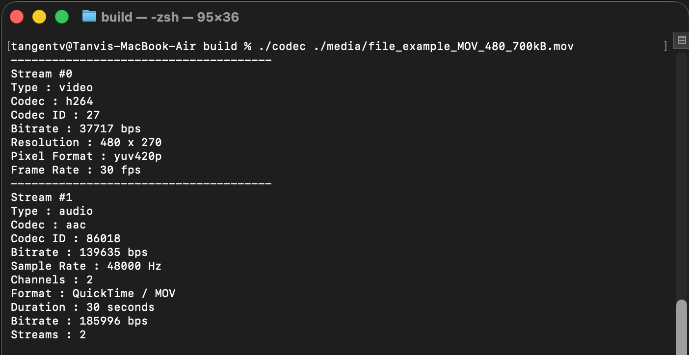

# CodecAnalyzer

**CodecAnalyzer** is a C++17-based multimedia application built using **FFmpeg** and **SDL2**. The project started as a console-based media/codec analyzer and is being progressively extended into a lightweight audio/video player.

The application demonstrates how modern multimedia playback works internally — from demuxing compressed media streams and decoding audio/video frames to rendering video and playing audio.

The project is being developed incrementally to explore **FFmpeg, multimedia pipelines, audio/video synchronization, SDL2, C++, and systems-level programming**.

## Current Capabilities

The application currently supports the following pipeline:

```text
                    Media File
                        │
                        ▼
                    FFmpeg
                    Demuxer
                        │
              ┌─────────┴─────────┐
              │                   │
        Video Stream          Audio Stream
              │                   │
              ▼                   ▼
       Video Decoder        Audio Decoder
              │                   │
            AVFrame             AVFrame
              │                   │
              ▼                   ▼
       Video Renderer       Audio Resampler
           (SDL2)           (libswresample)
              │                   │
              ▼                   ▼
          Video Output       Audio Renderer
                                  (SDL2)
```

### Media Analysis

The application can inspect media files and extract information such as:

* Container/format information
* Duration
* Overall bitrate
* Number of streams
* Video codec
* Video resolution
* Pixel format
* Frame rate
* Video bitrate
* Audio codec
* Sample rate
* Number of audio channels
* Audio sample format
* Audio bitrate

### Media Demuxing

The application uses FFmpeg's `libavformat` to:

* Open media containers
* Discover streams
* Identify video and audio streams
* Read compressed packets using `av_read_frame()`
* Route packets to the appropriate decoder

### Video Decoding

Video packets are decoded using FFmpeg's `libavcodec`.

Current video pipeline:

```text
Compressed H.264 Packet
          │
          ▼
     VideoDecoder
          │
          ▼
     Decoded AVFrame
          │
          ▼
     YUV420P Frame
          │
          ▼
      SDL2 Texture
          │
          ▼
     SDL2 Window
```

The renderer also uses video **PTS (Presentation Timestamp)** and the stream time base to control frame presentation timing.

### Audio Decoding

Audio packets are decoded using FFmpeg's `libavcodec`.

The current implementation supports the decoded audio produced by the test media, including:

```text
AAC
 │
 ▼
AudioDecoder
 │
 ▼
AVFrame
 │
 ├── Sample Rate: 48000 Hz
 ├── Channels: 2
 └── Format: FLTP
```

### Audio Resampling

FFmpeg's `libswresample` is used to convert decoded planar floating-point audio:

```text
FLTP
Planar Float
```

into interleaved floating-point PCM suitable for SDL audio playback:

```text
FLT
Interleaved Float
```

The resulting PCM data is queued to an SDL2 audio device.

### Audio Playback

SDL2 is currently responsible for audio output.

The current audio pipeline is:

```text
AAC Packet
    │
    ▼
AudioDecoder
    │
    ▼
AVFrame (FLTP)
    │
    ▼
libswresample
    │
    ▼
Interleaved Float PCM
    │
    ▼
SDL_QueueAudio()
    │
    ▼
SDL Audio Device
```

### Current Playback

The application can currently:

* Open a media file
* Analyze its streams
* Demux audio and video packets
* Decode H.264 video
* Decode AAC audio
* Render decoded video using SDL2
* Resample decoded audio using `libswresample`
* Play decoded audio through SDL2
* Process SDL window events
* Use video PTS for basic video presentation timing

## Technologies Used

* **C++17**
* **FFmpeg**

  * `libavformat`
  * `libavcodec`
  * `libavutil`
  * `libswscale`
  * `libswresample`
* **SDL2**
* **CMake**
* **GCC / Clang**
* **Git**

## Project Structure

```text
CodecAnalyzer/
│
├── include/
│   ├── AudioDecoder.h
│   ├── AudioRenderer.h
│   ├── Demuxer.h
│   ├── MediaAnalyzer.h
│   ├── StreamInfo.h
│   ├── VideoDecoder.h
│   └── VideoRenderer.h
│
├── src/
│   ├── AudioDecoder.cpp
│   ├── AudioRenderer.cpp
│   ├── Demuxer.cpp
│   ├── MediaAnalyzer.cpp
│   ├── StreamInfo.cpp
│   ├── VideoDecoder.cpp
│   ├── VideoRenderer.cpp
│   └── main.cpp
│
├── media/
│   └── sample media files
│
├── CMakeLists.txt
└── README.md
```

## Learning Objectives

This project is being developed as a practical exploration of multimedia and systems programming concepts, including:

* Multimedia container formats
* Demuxing vs. decoding
* FFmpeg architecture
* `AVPacket` and `AVFrame`
* Codec contexts
* Video pixel formats
* Audio sample formats
* PTS and DTS
* Stream time bases
* Video frame timing
* Audio resampling
* SDL2 rendering
* SDL2 audio playback
* Memory management in C++
* CMake-based builds
* Future multithreaded media pipelines

## Roadmap

The project is being developed incrementally.

* [x] Media information analyzer
* [x] Stream detection
* [x] Media demuxing
* [x] Video decoding
* [x] SDL2 video rendering
* [x] Video PTS-based timing
* [x] Audio decoding
* [x] Audio resampling using `libswresample`
* [x] SDL2 audio playback
* [ ] Proper audio/video synchronization
* [ ] Audio/video packet queues
* [ ] Separate audio/video processing threads
* [ ] Playback controls
* [ ] Pause/resume
* [ ] Seeking
* [ ] Support for additional media formats and codecs
* [ ] Improved error handling and resource management

## Goal

The long-term goal of **CodecAnalyzer** is to evolve the project from a simple codec analyzer into a small, educational multimedia player while keeping the implementation understandable and focused on the underlying concepts.

Rather than relying on a high-level media-player framework, the project explores the individual stages of a playback pipeline using **FFmpeg, SDL2, and modern C++**.


Build dteps:

1. cd build
2. cmake ..
3. cmake --build . -j.   OR     cmake --build build

## Screenshots

### Codec Analysis




              

* The basec FFmpeg flow is :

                Input file
                    │
                    ▼
                avformat_open_input()
                    │
                    ▼
                AVFormatContext
                    │
                    ├── Container information
                    │
                    └── Streams
                        │
                        ├── Video → AVCodecParameters
                        │
                        ├── Audio → AVCodecParameters
                        │
                        └── Subtitle / Data


What we have implemented so far : 

- AVFormatContext
- Demuxing with av_read_frame()
- Identifying video/audio streams
- H.264 decoding
- AAC decoding
- AVPacket → AVFrame
- Video PTS/time-base handling
- SDL2 video rendering
- SDL2 audio output
- fltp → FLT conversion using libswresample
- Audio queuing with SDL_QueueAudio()


Next step:
A/V synchronization
